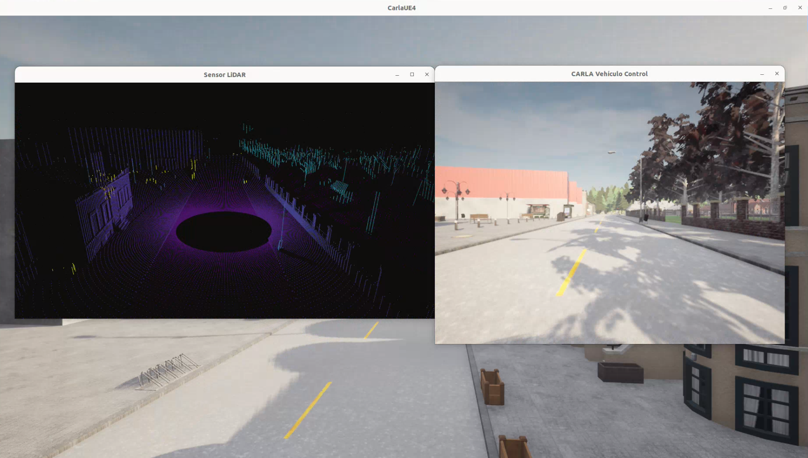

# README

**Brain Predict** es una versión modificada del módulo *Brain* en la que, además de visualizar la cámara frontal y la nube de puntos del sensor LiDAR del vehículo simulado en **CARLA**, el propio vehículo es capaz de conducirse de forma autónoma.

La conducción autónoma se logra mediante la inferencia de un modelo de aprendizaje profundo basado en **PilotNet**, que predice los valores de los actuadores **steering** y **throttle** a partir de las imágenes capturadas por la cámara frontal del vehículo.

---

## Estructura del código

El sistema de nuestro cerebro de predicción se organiza en varios módulos, cada uno con una responsabilidad bien definida dentro del pipeline de percepción, predicción y control:

### `brain_predict.py`
Es el **fichero principal** del sistema.

- Inicializa el entorno de simulación en CARLA.
- Crea y gestiona los sensores del vehículo (cámara y LiDAR).
- Carga el modelo entrenado de PilotNet.
- Recibe los datos de la cámara en tiempo real.
- Ejecuta la inferencia del modelo para obtener `steer` y `throttle`.
- Envía las predicciones al módulo de control del vehículo.
- Coordina la visualización de la cámara frontal y la nube de puntos LiDAR.

Actúa como el **nexo central** entre percepción, red neuronal y control.

---

### `vehicle_control.py`
Encapsula la **lógica de control del vehículo**.

- Traduce las predicciones del modelo (`steer`, `throttle`) a comandos compatibles con CARLA.
- Aplica los valores de control al vehículo simulado.

Este módulo facilita modificar o limitar los comandos de control sin afectar al resto del código.

---

### `camera.py`
Gestiona el **sensor de cámara RGB frontal**.

- Configura la cámara (resolución, FOV, posición).
- Convierte las imágenes al formato adecuado para el modelo.
- Permite la visualización en pantalla.

Es la **fuente principal de información** utilizada por el modelo de PilotNet.

---

### `lidar_semantic.py`
Gestiona el **sensor LiDAR semántico**.

- Inicializa y configura el LiDAR del vehículo.
- Recibe la nube de puntos semántica desde CARLA.
- Procesa los datos para su visualización.
- Permite alternar diferentes vistas del LiDAR (pulsando la tecla 'V').

En esta versión del sistema, el LiDAR se utiliza **únicamente con fines de visualización y análisis**, no como entrada al modelo de predicción.

---

### `pilotnet.py`
Define y gestiona el **modelo de aprendizaje profundo**.

- Implementa la arquitectura de PilotNet.
- Carga los pesos entrenados desde un checkpoint.
- Prepara el modelo para inferencia.
- Ejecuta la predicción de `steer` y `throttle` a partir de imágenes RGB.

Este módulo encapsula toda la lógica relacionada con la red neuronal, manteniéndola separada del código de simulación.

---

## Flujo general del sistema

1. CARLA genera los datos de los sensores.
2. La cámara frontal envía imágenes al sistema.
3. El modelo PilotNet predice los valores de control.
4. El módulo de control aplica las acciones al vehículo.
5. El vehículo se conduce de forma autónoma en la simulación.

---

